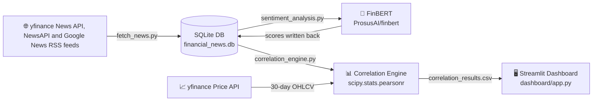

# 📊 Financial News Sentiment & Stock Signal Dashboard

A fully automated, end-to-end financial NLP pipeline that ingests live news
for NSE-listed equities, scores headlines with a domain-adapted language
model, correlates sentiment against market price movements, and surfaces
actionable signals through an interactive dashboard.

---

## 🗺️ Pipeline Architecture



---

## 🗂️ Project Structure

```
finance project/
├── scripts/
│   ├── fetch_news.py          # Sprint 1 – News ingestion & validation
│   ├── sentiment_analysis.py  # Sprint 2 – FinBERT inference
│   └── correlation_engine.py  # Sprint 3 – Pearson correlation
├── dashboard/
│   └── app.py                 # Sprint 4 – Streamlit UI
├── data/
│   ├── financial_news.db      # SQLite store (auto-created)
│   ├── data_quality.json      # Validation report (auto-created)
│   └── correlation_results.csv# Merged dataset (auto-created)
├── logs/
│   └── pipeline.log           # Unified log file
├── setup_project.py           # One-time folder initialiser
└── requirements.txt
```

---

## ⚡ Quick Start

### 1. Install dependencies

```bash
pip install -r requirements.txt
```

> **GPU users:** Install the matching CUDA build of PyTorch first:
> ```bash
> pip install torch --index-url https://download.pytorch.org/whl/cu121
> ```

### 2. Run the pipeline

```bash
# Step 1 – Ingest news and populate SQLite
python scripts/fetch_news.py

# Step 2 – Score headlines with FinBERT
python scripts/sentiment_analysis.py

# Step 3 – Compute sentiment–price correlation
python scripts/correlation_engine.py

# Step 4 – Launch the interactive dashboard
streamlit run dashboard/app.py
```

---

## 🧠 Why FinBERT?

Generic sentiment models (e.g., VADER, TextBlob) are trained on product
reviews, social media, and news corpora where words carry everyday meanings.
Financial language is fundamentally different:

| Term | General meaning | Financial meaning |
|------|----------------|-------------------|
| *positive* | Good / happy | Profit, growth, upgrade |
| *loss* | Missing something | Net loss, write-down |
| *above expectations* | Vague praise | **Strong bullish signal** |
| *headwinds* | Wind direction | Macro risk, earnings drag |

**FinBERT** (Araci, 2019) is a BERT model fine-tuned on _Financial PhraseBank_
and thousands of Reuters/Bloomberg articles.  It natively understands
financial jargon, giving significantly higher accuracy on financial text than
any general-purpose model.

---

## 🛡️ Data Integrity

Every ingestion run passes through `clean_and_validate()`, which:

1. **Deduplicates** on headline text – prevents the same story from inflating
   sentiment scores across multiple runs.
2. **Drops incomplete rows** – records with a missing `title` or `publisher`
   are excluded, since they cannot be scored reliably.
3. **Emits a quality report** at `data/data_quality.json` containing:
   - `total_records` – raw articles pulled from the API
   - `duplicate_count` – exact-match duplicates found
   - `clean_data_percentage` – fraction of records retained after cleaning

The report is also surfaced inside the dashboard under the
*Data Quality Report* expander so any data health issues are immediately
visible without querying the database directly.

---

## 📐 Methodology

### Sentiment scoring

1. Each headline is tokenised with the FinBERT BPE tokenizer
   (`max_length = 512`, padding + truncation enabled).
2. The model produces three logits: **positive**, **negative**, **neutral**.
3. A **softmax** is applied to convert logits to a probability distribution.
4. The class with the highest probability becomes `sentiment_label`.
5. Its probability value is stored as `confidence_score`.
6. Labels are mapped to `sentiment_numeric`: **+1 / 0 / −1**.

### Correlation analysis

1. `sentiment_numeric` values are **resampled to a daily average** per ticker
   using `pandas.resample('D').mean()`.
2. The yfinance API provides 30-day daily closing prices, from which we compute
   **percentage daily returns**: `pct_change() × 100`.
3. The two daily series are **inner-joined on date** to ensure only days with
   both market data and news sentiment are compared.
4. **Pearson's r** (`scipy.stats.pearsonr`) quantifies the linear relationship
   between sentiment and next-day price movement.  A p-value is also reported.

### Signal logic

| avg_sentiment (last 5 headlines) | Signal |
|---|---|
| > +0.20 | 🟢 Bullish |
| < −0.20 | 🔴 Bearish |
| −0.20 to +0.20 | ⚪ Neutral |

---

## ⚠️ Limitations

1. **Short time window.**  Thirty days of price data is a very narrow window
   for a meaningful correlation study.  Statistical significance (p < 0.05)
   is unlikely with fewer than ~20 overlapping trading days per ticker.

2. **Small dataset.**  yfinance's `ticker.news` returns at most ~20 articles
   per ticker.  The sample size is insufficient to draw robust conclusions;
   consider supplementing with a news API (e.g., NewsAPI, Alpha Vantage News).

3. **Correlation ≠ causation.**  Even a strong Pearson correlation does not
   mean that news sentiment _drives_ stock prices.  Market-moving events
   simultaneously generate news coverage and price reactions.

4. **Stale cache.**  The dashboard caches data for 5 minutes (`ttl=300`).
   For real-time use-cases the TTL should be reduced or cache invalidation
   should be tied to the pipeline's completion.

5. **No forward-looking lag.**  This implementation compares same-day
   sentiment with same-day price change.  A more rigorous study would
   introduce a 1-day or n-day lag to test whether sentiment _predicts_
   future price movement.

---

## 📦 Dependencies

| Package | Purpose |
|---|---|
| `yfinance` | News & OHLCV market data ingestion |
| `pandas` | Data manipulation, resampling |
| `numpy` | Numerical operations |
| `transformers` | HuggingFace FinBERT model |
| `torch` | Deep learning inference (CPU/GPU) |
| `scipy` | Pearson correlation coefficient |
| `streamlit` | Interactive web dashboard |
| `plotly` | Dual-axis interactive charts |
| `tqdm` | Inference progress bar |

---

*Built using Python, HuggingFace Transformers, and Streamlit.*